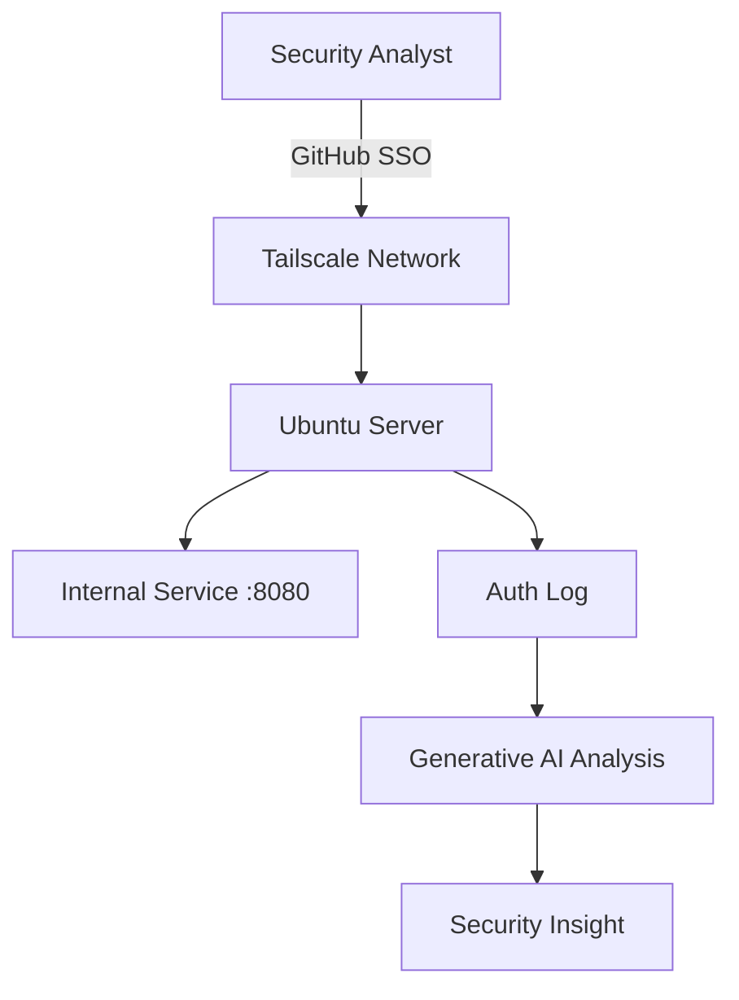

# Zero Trust & Identity Lab

## Introduction

Traditional network security relies on perimeter-based protection where devices inside the network are trusted.

Zero Trust Architecture removes this assumption and verifies every user and device before granting access.

This lab demonstrates how identity-based networking and least privilege access control can be implemented using open tools.

## Lab Objectives

In this lab you will:

1. Configure identity-based connectivity using Tailscale
2. Deploy a protected service
3. Implement micro-segmentation
4. Configure least privilege access
5. Use Generative AI to analyze security logs

## Step 1 — Identity-Based Connectivity

Traditional networks rely on IP-based trust. Devices inside the network are implicitly trusted.

Zero Trust Architecture removes this assumption and verifies the **identity of users and devices** before allowing access.

In this step we configure identity-based connectivity using **Tailscale**.

### Install Tailscale

Run the following command:

curl -fsSL https://tailscale.com/install.sh | sh

### Start Tailscale

sudo tailscale up

A browser window will open asking you to authenticate.

Choose **GitHub SSO** to log in.

### Verify the Connection

Run:

tailscale status

Expected output example:

100.x.x.x   ubuntu-server   username@   linux

This indicates that the device has successfully joined the **Tailscale secure mesh network** using identity-based authentication.

## Step 2 — Deploy a Protected Service

To demonstrate Zero Trust access control, we first deploy a simple internal service.

Run the following command:

python3 -m http.server 8080

Expected output:

Serving HTTP on 0.0.0.0 port 8080

Now open a browser and visit:

http://localhost:8080

You should see a directory listing page.

This service represents an **internal application running on port 8080** that will later be protected using Zero Trust access policies.

## Step 3 — Implement Micro-Segmentation using Tailscale ACLs

Zero Trust architectures restrict access to specific resources instead of allowing unrestricted network access.

To implement micro-segmentation, we configure an Access Control List (ACL) policy in the Tailscale Admin Console.

Open the admin console:

https://login.tailscale.com/admin

Navigate to **Access Controls** and modify the policy.

Example rule:

{
"grants": [
{
"src": ["user_identity"],
"dst": ["*"],
"ip": ["*:8080"]
}
]
}

This rule allows the user to access only the service running on port 8080.

All other ports and services are blocked, preventing lateral movement within the network.

## Step 4 — Implement the Principle of Least Privilege

Zero Trust architectures require that users receive only the permissions necessary to perform their tasks.

In this step we create a **Junior Administrator** role that can restart a service but cannot access sensitive system files.

### Create the User

Run:

sudo adduser junioradmin

Verify the user exists:

id junioradmin

### Configure Limited Administrative Access

Edit the sudo policy using:

sudo visudo

Add the following rule at the bottom of the file:

junioradmin ALL=(ALL) NOPASSWD: /bin/systemctl restart nginx

This rule allows the junior administrator to restart the nginx service but does not grant broader administrative privileges.

### Test the Policy

Switch to the user:

su - junioradmin

Allowed command:

sudo systemctl restart nginx

Restricted command:

sudo cat /etc/shadow

The second command should be denied, demonstrating that the user cannot access sensitive system files.

This demonstrates the **Principle of Least Privilege**, ensuring that users receive only the permissions required for their operational role.

## Step 5 — Using Generative AI as a Security Copilot

Security analysts often review authentication logs to identify suspicious activity.

View recent authentication logs:

sudo tail -n 20 /var/log/auth.log

Example log entry:

sudo: junioradmin : command not allowed ; COMMAND=/usr/bin/cat /etc/shadow

These logs can be analyzed using a Generative AI assistant.

Example prompt:

"Analyze the following Linux auth.log entries and identify potential security violations. Explain what happened and recommend mitigation steps."

Generative AI can help analysts:

• explain authentication failures
• identify privilege escalation attempts
• detect brute-force login patterns

This demonstrates how **AI can assist security teams in interpreting log data and improving incident response.**

