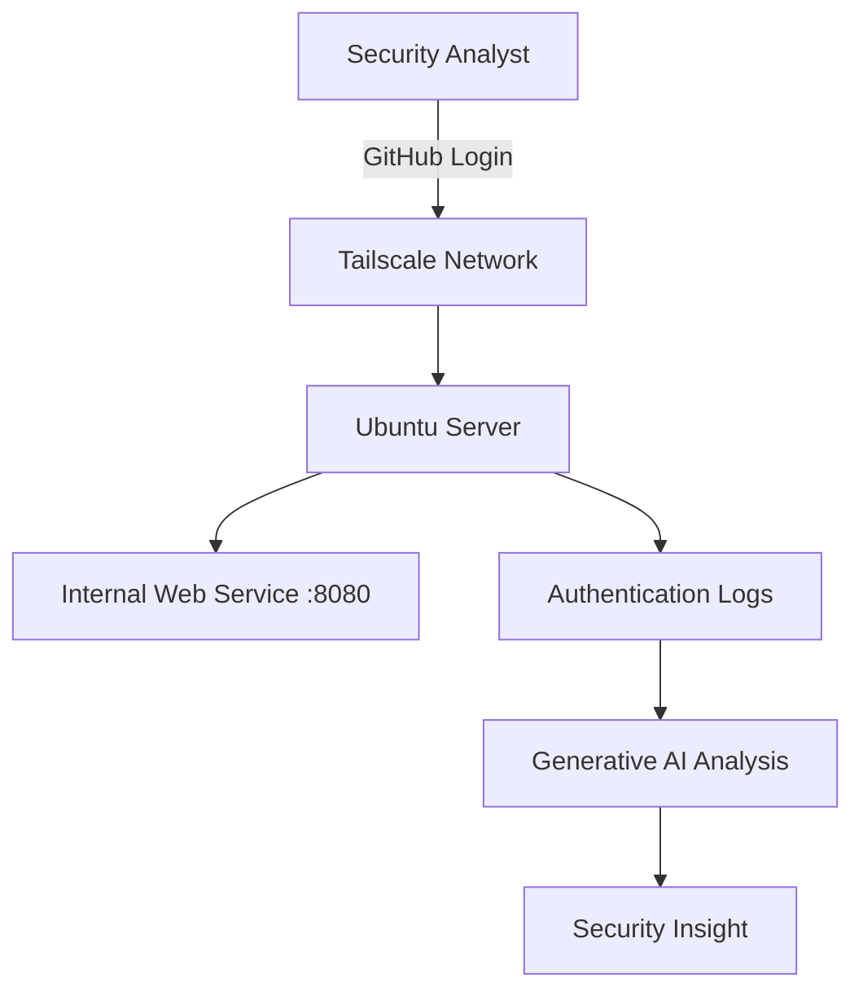

# Zero Trust & Identity Lab

## Introduction

Traditional networks often trust devices once they are inside the network.  
For example, if a computer connects to an office Wi-Fi network or VPN, it may automatically gain access to internal systems.

This can be dangerous because if an attacker gains access to the network, they may be able to move between systems easily.

**Zero Trust Architecture (ZTA)** removes this assumption.  
Instead of trusting devices automatically, every user and device must be **verified before access is granted**.

In this lab you will build a simple environment that demonstrates the key ideas behind Zero Trust security.

Even if you have **never worked with these tools before**, you should be able to follow the instructions step-by-step.

---

# Prerequisites

Before starting the lab, make sure you have:

- A computer running **Windows, macOS, or Linux**
- An **Ubuntu Linux environment** (WSL, Virtual Machine, or native install)
- A **GitHub account**
- Internet access
- Basic ability to run commands in a terminal

---

# Lab Objectives

After completing this lab you will be able to:

- Understand the concept of **Zero Trust Architecture**
- Configure **identity-based networking using Tailscale**
- Deploy a simple internal service
- Implement **micro-segmentation**
- Apply the **Principle of Least Privilege**
- Use **Generative AI to analyze authentication logs**

---

# Architecture Overview

The diagram below shows how the system works.



In this architecture:

- The user logs in using **GitHub identity**
- Tailscale creates a **secure network connection**
- The Ubuntu server runs an internal service
- Access policies restrict network access
- System logs are analyzed using AI

---

# Step 1 — Configure Identity-Based Connectivity

Traditional networks rely on **IP addresses** to determine access.

Zero Trust instead verifies **identity**.

We will use **Tailscale** to create a secure identity-based network.

---

## Install Tailscale

Run the following command:

```
curl -fsSL https://tailscale.com/install.sh | sh
```

What this command does:

- Downloads the official Tailscale installer
- Installs the software on your system

---

## Start Tailscale

Run:

```
sudo tailscale up
```

A browser window will open asking you to authenticate.

Choose **GitHub login**.

This connects your device to the Tailscale network.

---

## Verify the Connection

Run:

```
tailscale status
```

Example output:

```
100.x.x.x   ubuntu-server   username@   linux
```

If you see an IP address starting with **100.x.x.x**, the connection was successful.

---

### Why This Step Matters

Identity-based networking ensures that only **verified users and devices** can join the network.

This is a core principle of **Zero Trust security**.

---

# Step 2 — Deploy a Protected Service

Next we create a simple internal service.

Run:

```
python3 -m http.server 8080
```

Expected output:

```
Serving HTTP on 0.0.0.0 port 8080
```

Open your browser and go to:

```
http://localhost:8080
```

You should see a **directory listing page**.

---

### Why This Step Matters

This service represents an **internal application** that needs to be protected from unauthorized access.

---

# Step 3 — Implement Micro-Segmentation

Micro-segmentation restricts access to specific services instead of allowing full network access.

This prevents attackers from moving between systems inside the network.

Open the Tailscale admin console:

```
https://login.tailscale.com/admin
```

Navigate to:

```
Access Controls
```

Replace the policy with the following example:

```json
{
  "grants": [
    {
      "src": ["user_identity"],
      "dst": ["*"],
      "ip": ["*:8080"]
    }
  ]
}
```

Explanation:

- `src` → the user identity
- `dst` → destination device
- `ip` → allowed port

This rule allows access **only to port 8080**.

---

### Why This Step Matters

Even if a user joins the network, they cannot access every service.

This reduces the risk of **lateral movement**.

---

# Step 4 — Apply the Principle of Least Privilege

The **Principle of Least Privilege** means that users should receive only the permissions necessary to perform their tasks.

We will create a limited administrator account.

---

## Create the User

Run:

```
sudo adduser junioradmin
```

Verify the user exists:

```
id junioradmin
```

---

## Configure Limited Administrative Access

Edit the sudo configuration:

```
sudo visudo
```

Add this rule at the bottom:

```
junioradmin ALL=(ALL) NOPASSWD: /bin/systemctl restart nginx
```

This allows the user to restart the nginx service but nothing else.

---

## Test the Policy

Switch to the user:

```
su - junioradmin
```

Allowed command:

```
sudo systemctl restart nginx
```

Restricted command:

```
sudo cat /etc/shadow
```

The second command should be denied.

---

### Why This Step Matters

Limiting permissions reduces the damage that could occur if an account is compromised.

---

# Step 5 — Use Generative AI as a Security Copilot

Security analysts often review logs to identify suspicious activity.

View recent authentication logs:

```
sudo tail -n 20 /var/log/auth.log
```

Example log entry:

```
sudo: junioradmin : command not allowed ; COMMAND=/usr/bin/cat /etc/shadow
```

These logs can be analyzed using an AI assistant.

Example prompt:

```
Analyze the following Linux authentication logs.

Identify suspicious login attempts, privilege escalation attempts,
and potential security issues. Explain what happened and recommend
mitigation steps.
```

AI can help analysts:

- interpret log entries
- identify suspicious behavior
- suggest security improvements

---

# Conclusion

In this lab you implemented several core Zero Trust security concepts:

- Identity-based networking
- Micro-segmentation
- Least-privilege access control
- AI-assisted log analysis

These techniques help organizations improve security by verifying identity, restricting access, and monitoring system activity.

---

# Check Your Understanding

1. What is the main idea behind Zero Trust Architecture?
2. Why is identity verification important in modern networks?
3. How does micro-segmentation reduce risk?
4. Why is least privilege important for system security?
